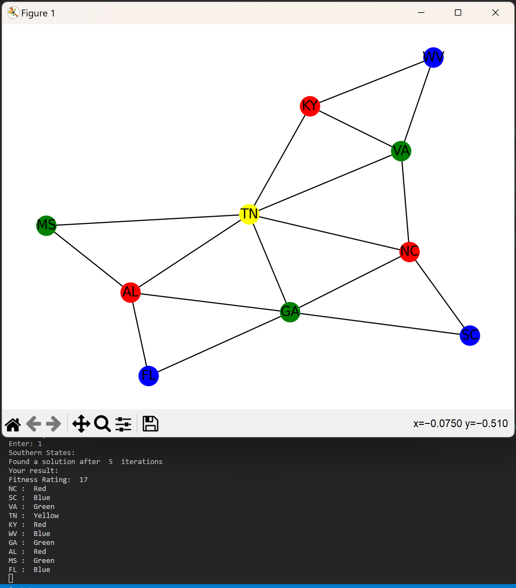
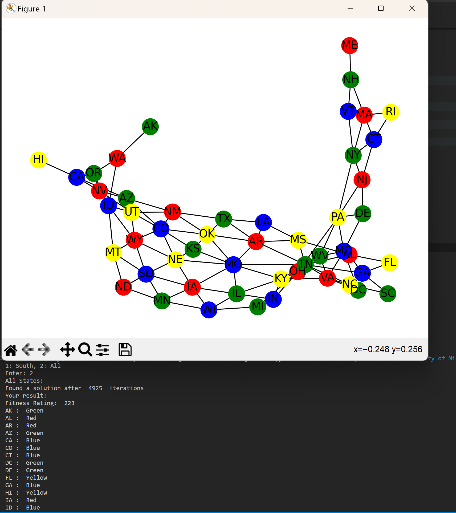

# Description
    - Using a framework provided by Fan Zhang, a former student, we are using a genetic algorithm to solve the four color theorem for the United States of America
# Requirements
    - Matplotlib
        - pip install matplotlib
    - Networkx (Graph Visualization)
        -pip install networkx
# Running
    - Run main.py
    - Input 1, instant output of the southern states
    - Input 2, approximately 3 minute wait time for entire United States
# Output
   
   